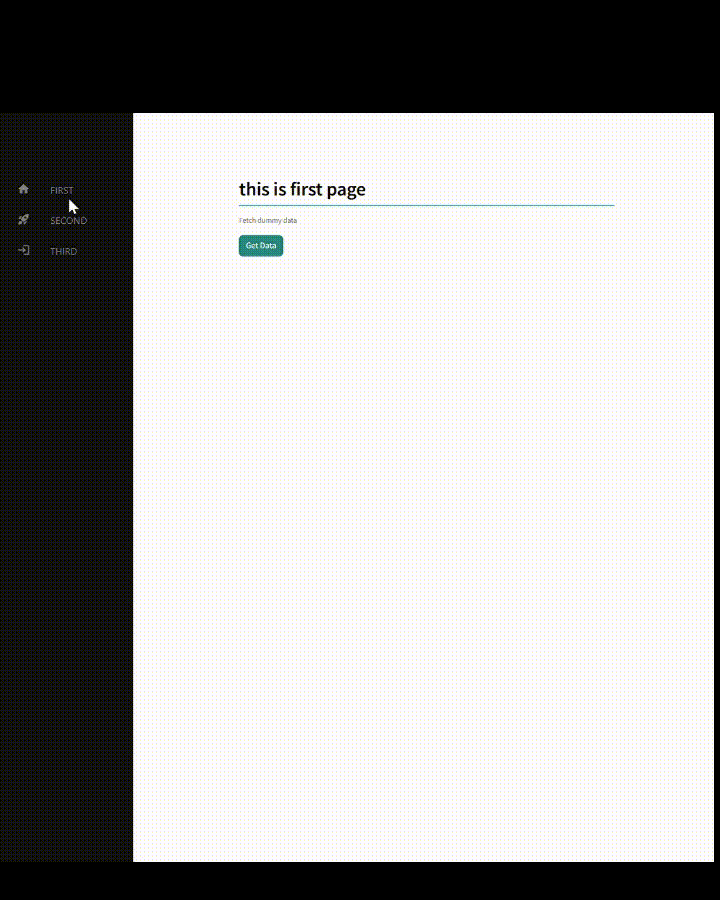

# streamlit-sidebar-template

## Features

- A template for medium-scale Streamlit development using [streamlit-on-Hover-tabs](https://github.com/Socvest/streamlit-on-Hover-tabs)

- [streamlit-on-Hover-tabs](https://github.com/Socvest/streamlit-on-Hover-tabs) を用いた中規模 streamlit 開発向けのテンプレート

## gif



## Starting the project locally

1. Clone the repository

   ```bash
   git clone https://github.com/akihiko-ima/streamlit-sidebar-template
   ```

2. Install dependencies

   ```bash
   python3 -m venv env_st_template
   source /env_st_template/bin/activate
   pip3 install -r requirements.txt
   ```

3. Run the development server

   ```bash
   streamlit run app.py
   ```

## Directory structure

- (\*) 要変更

```bash
streamlit-sidebar-template/
├── .streamlit/                  # streamlit標準config
│   └── config.toml
├── components/                  # (*) UIコンポーネント (サイドコンポーネント以外に追加も可能)
│   └── sidebar_component.py
├── router/                      # ルーティング
│   ├── __init__
│   └── router.py
├── services/                    # (*) 横断的な汎用関数
│   └── get_data.py
├── views/　　　                  # (*) 関数コンポーネント (React / Nextjsで採用されている構成)
│   ├── __init__.py
│   ├── first_page.py
│   ├── second_page.py
│   └── third_page.py
├── app.py                        # エントリポイント
├── config.py　　　　　　　　　　　 # (*) ルーティング設定
└── global.css                    # サイドコンポーネント

```

## Icon for sidebar

The icons in the sidebar use "Google Fonts."<br>
[https://fonts.google.com/icons](https://fonts.google.com/icons)

## Demo

Apps created with this template are now available and hosted on Streamlit Cloud.　[Click here](https://stockprice-imaima.streamlit.app/) to visit.
<br>
